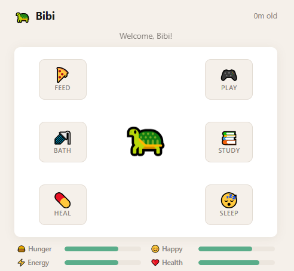

# Webgotchi



> Webgotchi is a Tamagotchi-inspired project designed to be played online!

It’s super simple: choose an emoji, give it a name, and take care of your little buddy.

## Features

### Local Save + File Persistence

Your pet’s entire state is encoded into a hash string and stored in your browser’s localStorage.

However, you can also download this save file to:

* Load your pet on another computer
* Prevent data loss if you clear your browser storage
* Keep a permanent backup of your Webgotchi

If you ever lose your local data, simply upload your saved file and your pet will be restored instantly.

Fully Client-Side & Lightweight

Webgotchi is built entirely with HTML, CSS, and JavaScript.

* No backend
* No server requests
* No databases
* No accounts

Everything runs locally in your browser, making the game extremely lightweight and responsive in any environment.

## Local Development

If you'd like to contribute:

1. Clone the repository
2. Open index.html directly in your browser

Or, if you prefer running a local server (recommended for ES modules):

```
python3 -m http.server 5000
```

Then open:

```
http://localhost:5000
```

### How to Contribute

Contributions are welcome!

Here are some ways you can help:

* Add new mini-games
* Add animations or transitions
* Enhance mobile experience
* Bug report/fixes
* New features

### Contribution Steps

1. Fork the repository
2. Create a feature branch
3. Make your changes
4. Open a Pull Request

Please keep the project lightweight and fully client-side (no backend).
